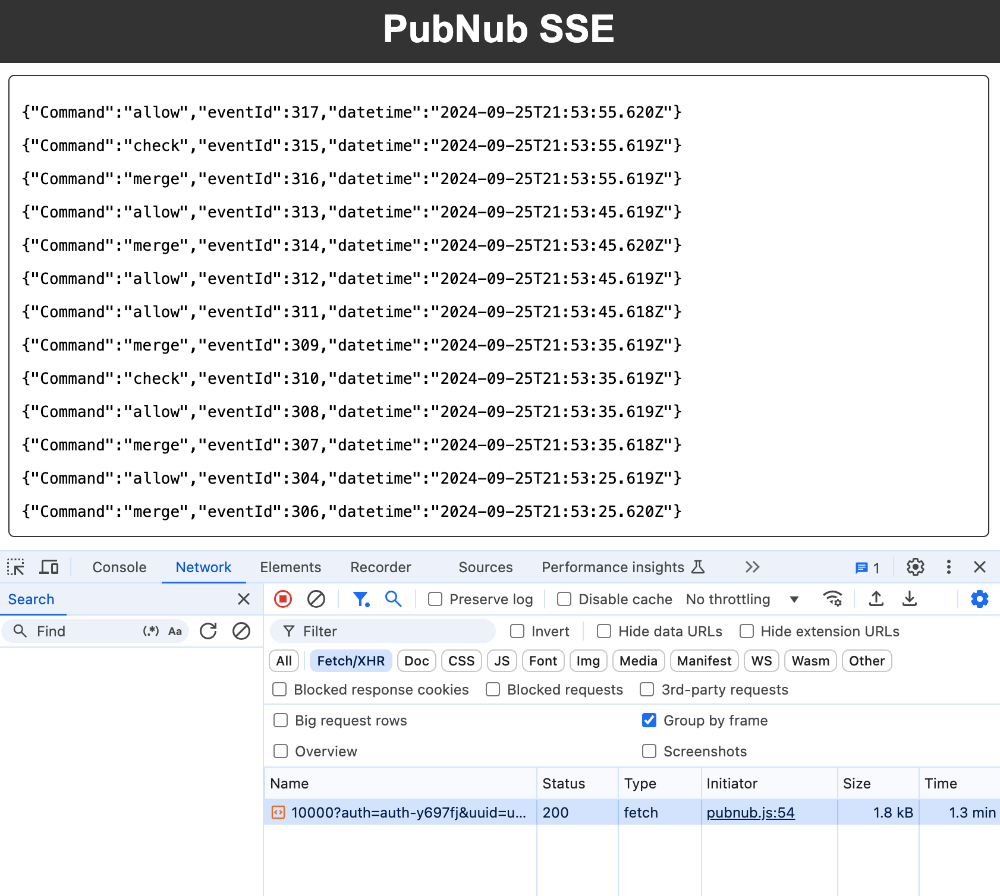

# PubNub SSE

Easy to use PubNub SDK with SSE enabled by default.

See `index.html` for example.



Setup the SDK as follows in the example.

```html
<script src="pubnub.js"></script>
<script>

// PubNub Setup
const userId = Math.random().toString(36).substring(7);
const authKey = 'auth-key';
const channel = 'Commands';
const pubkey = 'pub-c-a88f5e0f-af28-4847-ad52-30495d0cbcb8';
const subkey = 'sub-c-a8cbfccb-676b-4034-9681-dfed95af8d7e';
const pubnub = PubNub({
    subscribeKey: subkey,
    publishKey: pubkey,
    authKey: authKey,
    userId: userId,
});

// Subscribe to Events
const subscription = pubnub.subscribe({
    channel: channel,
    messages: receiveEvents,
});

// End subscription
// subscription.unsubscribe();

// Event Processing
const events = document.getElementById('events');
function receiveEvents(event) {
    events.innerHTML = `<p>${JSON.stringify(event)}</p>` + events.innerHTML;
}

// Publish Events Example
let eventId = 0;
setInterval(() => {
    pubnub.publish({
        channel: channel,
        message: {
            eventId: ++eventId, 
            userId: userId,
            data: `Event ${eventId} from ${userId} at ${new Date().toISOString()}`,
        },
    });
}, 1000);

</script>
```
